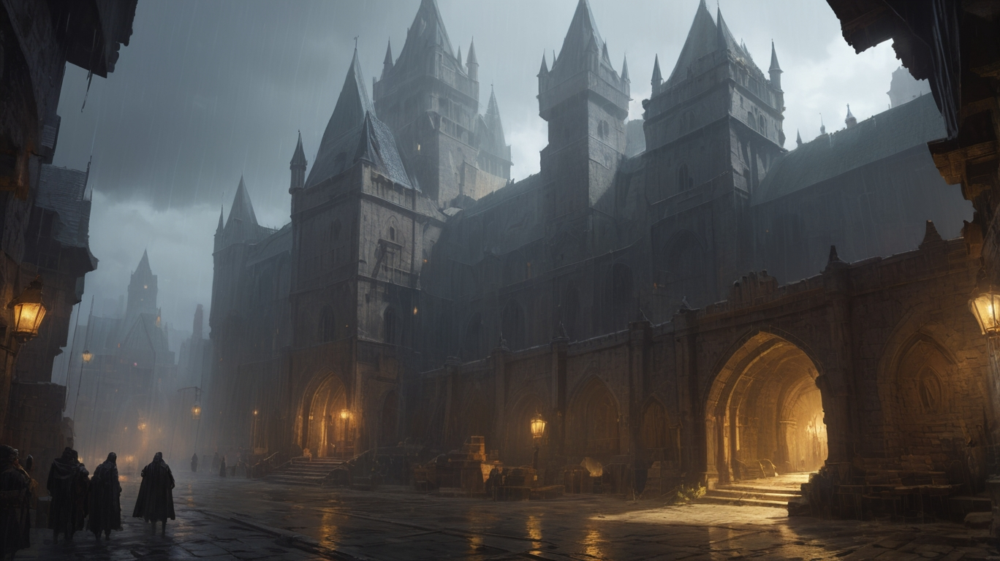

# Aethelred: La Llamada a la Aventura

¡Adéntrate en el mundo de Aethelred, un juego de rol de mesa donde la mitología, el Libro de Enoc y un sistema de cartas se entrelazan en una aventura épica!

## Introducción: La Llamada a la Aventura

La majestuosa ciudad de Aethelburg, capital del reino de Eldoria, se encuentra al borde del abismo. El Amuleto de Aethelred, un artefacto mágico que protege la tierra de las fuerzas oscuras, ha desaparecido, sumiendo al reino en la incertidumbre y el peligro.

La reina Elara, en un acto de desesperación, ha lanzado una llamada a la aventura. Un pergamino real, adornado con letras doradas y un sello de gran poder, anuncia una misión secreta de suma importancia. Se buscan héroes valientes y astutos, dispuestos a enfrentarse a peligros desconocidos a cambio de una generosa recompensa.

La Taberna del Dragón Durmiente, un establecimiento de mala fama conocido por ser el punto de reunión de mercenarios, exploradores y otros personajes de dudosa reputación, ha sido designada como el lugar de encuentro para los aspirantes. Brunilda, la corpulenta y enérgica tabernera, será la encargada de recibir a los aventureros y evaluar su potencial.

¿Serás tú uno de los elegidos para recuperar el Amuleto de Aethelred? ¿Podrás superar las pruebas y desafíos que te aguardan en el camino? ¿O caerás en las garras de las fuerzas oscuras que acechan en las sombras?

## Elementos del Juego

*   **Exploración y narrativa:** Sumérgete en un mundo rico en detalles, donde la historia y los secretos te esperan en cada esquina.
*   **Mitología y el Libro de Enoc:** Descubre elementos de la mitología y el Libro de Enoc que dan forma al mundo de Aethelred.
*   **Sistema de cartas:** Gestiona tus recursos, habilidades y eventos a través de un sistema de cartas estratégico y dinámico.
*   **Combate por turnos:** Participa en emocionantes combates por turnos, donde la estrategia y la habilidad serán clave para la victoria.
*   **Dualidad del bien y el mal:** Explora la eterna lucha entre el bien y el mal, donde tus elecciones tendrán un impacto significativo en el destino del reino.
*   **Libertad de elección:** Forja tu propio camino y decide cómo te enfrentarás a los desafíos que se presenten.

## Jugabilidad

*   **Personajes personalizables:** Elige tu clase (Guerrero Valiente, Hechicera Astuta, Ladrón Escurridizo, Explorador Ingenioso o Bardo Carismático), género y nombre. Cada clase tiene habilidades únicas y atributos específicos.
*   **Gestión de recursos:** Utiliza tus recursos (Furia, Maná, Energía, Resistencia o Inspiración) de forma estratégica para realizar habilidades especiales y sobrevivir a los peligros.
*   **Sistema de cartas:** Obtén tarjetas de diferentes tipos (Comida, Bebida, Descanso, Estadísticas, Eventos) y utilízalas sabiamente para mejorar tus habilidades, obtener ventajas en combate o desencadenar eventos inesperados.
*   **Combate por turnos:** Planifica tus ataques y defensas cuidadosamente, aprovechando las habilidades de tu personaje y las tarjetas que tengas a tu disposición.

## ¡La aventura te espera!

¿Estás listo para responder a la llamada a la aventura? ¡El mundo de Aethelred te necesita!